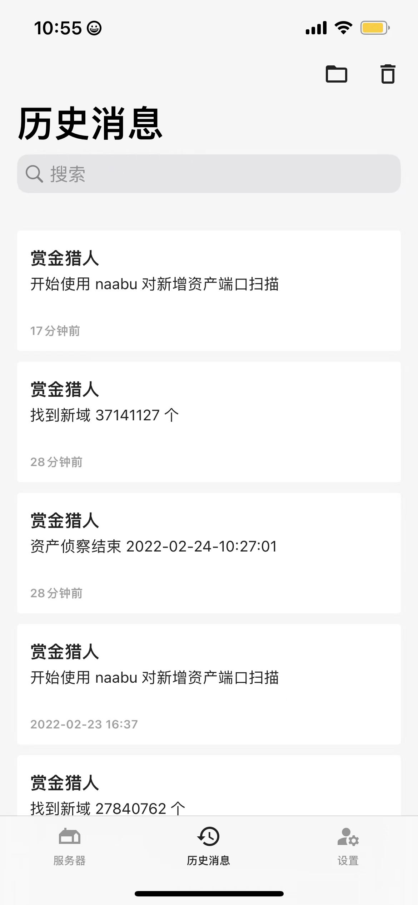

<!--
 * @Date: 2022-02-24 10:18:54
 * @LastEditors: recar
 * @LastEditTime: 2022-02-24 16:11:00
-->
# toBtg

自动化通知的 可以接收`管道`信息 发一个请求给消息通知的  
在shell自动化上可以使用 
只是一个小脚本 方便shell管道做消息通知   

借花献佛
to borrow sth. to make a gift of it 

## 为啥
本来是使用notify来做的  
符合我能用的只有邮件 但是邮件好像有问题不能使用  
我查了几种方式 通用的有方糖微信通知 但是方糖一个月只免费5条  
苹果的话 可以使用 Bark  
于是我就做了Bark了 一想方糖这种也是可以加进来  

## 配置api
支持 `配置文件yaml` `环境变量` `命令行参数` 如下:  

1. 使用conf.yaml
默认使用的配置文件在这个目录  
`/root/.toBtg/conf.yaml`  
```yaml
barkapi: https://api.day.app/xxx/赏金猎人
sctapi: https://sctapi.ftqq.com/xxxxxxx.send?title=赏金猎人&desp=
```

2. 使用环境变量
先设置环境变量
```shell
export BARK_API="https://api.day.app/xxxxx/赏金猎人/"
export SCT_API="https://sctapi.ftqq.com/xxxxx.send?title=赏金猎人&desp="
```


3. 使用命令行参数指定api
`subfinder -d hackerone.com | toBtg -b https://api.day.app/xxxxx/赏金猎人/`
`subfinder -d hackerone.com | toBtg -s https://sctapi.ftqq.com/xxxxx.send?title=赏金猎人&desp=`

## 使用
可以将 toBtg cp到 /user/bin 目录下 就可以全局使用啦  
使用的话 `subfinder -d hackerone.com | toBtg`
收到通知就是ok了  


## Bark说明

在 `App Store` 下载 `Bark` 打开后 注册设备 复制api 到`toBtg`  
Bark支持自己部署后端服务器 并设置api  

## 方糖
方糖的地址 https://sct.ftqq.com/  


## 看下效果

